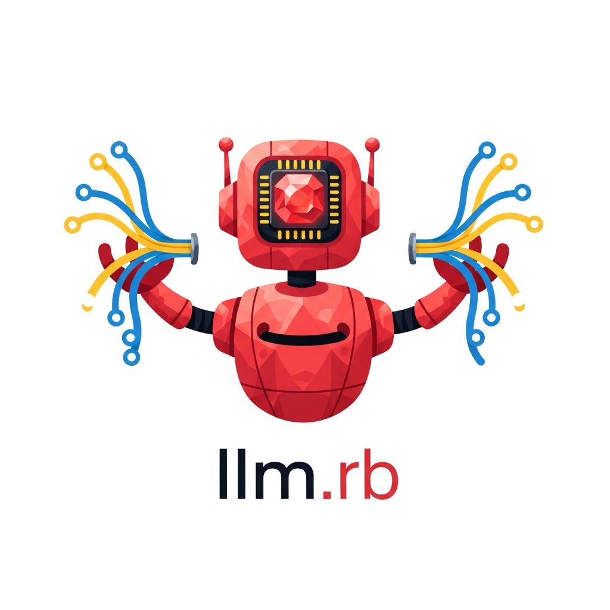

<p align="center">
  <a href="easytalk"></a>
</p>

## About

A small demo app for [llm.rb](https://github.com/llmrb/llm.rb).

## Features

- Rack-based server with Falcon
- Stream chat over WebSockets
- Tool calls (see [app/tools/](app/tools))
- Chat with OpenAI, Gemini, Anthropic, and DeepSeek

## Usage

**Secrets**

Set your secrets in `.env`:

```sh
OPENAI_SECRET=...
GEMINI_SECRET=...
ANTHROPIC_SECRET=...
DEEPSEEK_SECRET=...
```

**Packages**

Install Ruby gems:

```sh
bundle install
```

Build the frontend:

```sh
bundle exec rake build
```

**Serve**

Start the server:

```sh
set -a
. ./.env
set +a
bundle exec falcon serve --bind http://localhost:9292
```

## How It Works

- [config.ru](./config.ru) starts the app and serves [public/](./public/)
- [app/controllers/websocket.rb](./app/controllers/websocket.rb) keeps one chat session per WebSocket
- assistant output is sent as streaming websocket events
- the provider dropdown reconnects with the selected provider

## Files

- [config.ru](./config.ru)
- [app/controllers/websocket.rb](./app/controllers/websocket.rb)
- [app/tools/create_image.rb](./app/tools/create_image.rb)
- [public/App.js](./public/App.js)
- [public/index.html](./public/index.html)
